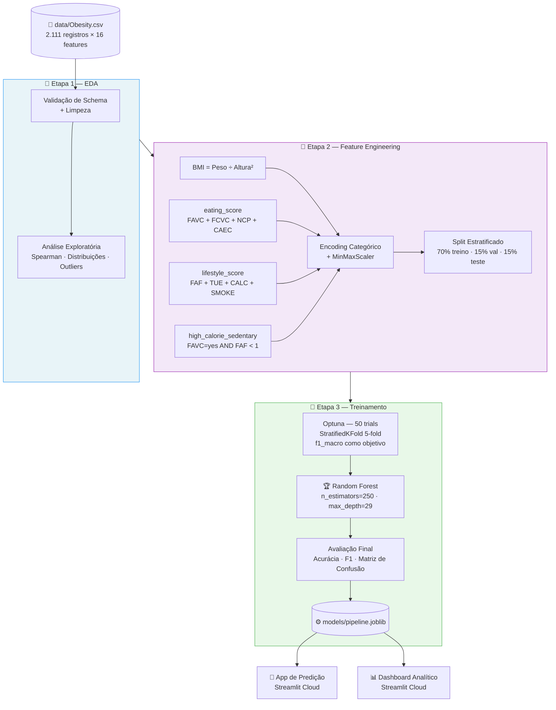
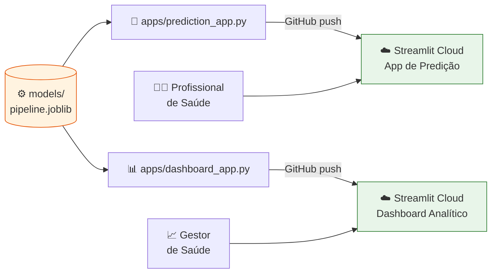

# 🏥 Predição de Obesidade — Tech Challenge 04


Projeto de machine learning para classificação do nível de obesidade com base em hábitos alimentares, atividade física e características antropométricas. Desenvolvido como Tech Challenge da Fase 4 do programa PosTech Data Analytics da FIAP.

---

## 🎯 O Problema

> *"No Brasil, mais de 60% da população adulta está acima do peso. A classificação do nível de obesidade vai muito além do IMC — envolve hábitos alimentares, atividade física, histórico familiar e estilo de vida."*

A obesidade é uma das maiores crises de saúde pública do mundo. Classificar corretamente o nível de risco de um paciente exige considerar múltiplos fatores simultaneamente — algo que um modelo de machine learning faz com consistência e escala.

```text
┌─────────────────────────────────────────────────────────────────────┐
│                    ESPECTRO DE PESO CORPORAL                        │
│                                                                     │
│  🔵          🟢           🟡      🟠      🔴    🔴    🔴           │
│  Abaixo   Normal      Sobrepeso  Sobrepeso  Ob.I  Ob.II  Ob.III    │
│  do Peso  ──────────  ──Nível I──Nível II──────────────────────    │
│                                                                     │
│  IMC < 18.5  18.5–24.9   25–26.9  27–29.9  30–34.9  35–39.9  ≥40  │
│                                                                     │
│  ← Risco nutricional          Risco metabólico e cardiovascular →  │
└─────────────────────────────────────────────────────────────────────┘
```

**O que este sistema entrega:** o profissional de saúde insere os dados do paciente e recebe, em segundos, uma classificação em 7 níveis com alertas de risco personalizados e recomendações clínicas contextualizadas.

---

## 📊 Os Dados

O dataset **ObesityDataSet** contém **2.111 registros** com **16 variáveis** coletadas de pacientes do México, Peru e Colômbia.

### Distribuição das 7 Classes (dataset balanceado)

```text
Classe                  Registros   Proporção
──────────────────────────────────────────────
🔴 Obesidade Tipo I        351        16,6%  ████████████████▋
🔴 Obesidade Tipo III      324        15,3%  ███████████████▎
🔴 Obesidade Tipo II       297        14,1%  ██████████████
🟠 Sobrepeso Nível I       290        13,7%  █████████████▋
🟠 Sobrepeso Nível II      290        13,7%  █████████████▋
🟢 Peso Normal             287        13,6%  █████████████▌
🔵 Abaixo do Peso          272        12,9%  ████████████▉
──────────────────────────────────────────────
Total                    2.111       100,0%
```

> Dataset bem balanceado entre as 7 classes — nenhuma classe domina, o que favorece o aprendizado do modelo.

### Variáveis do Dataset

| Categoria                 | Variáveis                                                                       |
| ------------------------- | ------------------------------------------------------------------------------- |
| **Antropométricas**       | Gênero, Idade, Altura, Peso                                                     |
| **Hábitos Alimentares**   | Consumo calórico (FAVC), Vegetais (FCVC), Refeições/dia (NCP), Petiscos (CAEC)  |
| **Saúde e Comportamento** | Histórico familiar, Tabagismo, Água (CH2O), Monitoramento calórico (SCC)        |
| **Estilo de Vida**        | Atividade física (FAF), Tempo de tela (TUE), Álcool (CALC), Transporte (MTRANS) |

---

## 🔍 Descobertas do EDA

### Insight 1 — Peso e Histórico Familiar são os maiores preditores

Correlação de Spearman entre cada variável e o nível de obesidade (0 = Abaixo do Peso → 6 = Obesidade Tipo III):

```text
Variável          Correlação   Direção
──────────────────────────────────────────────────────────────────
Weight (Peso)       +0.921   ████████████████████████  ↑ Risco
family_history      +0.680   █████████████████         ↑ Risco
FCVC (Vegetais)     +0.260   ██████▌                   ↑ (ordinal)
Age (Idade)         +0.409   ██████████▎               ↑ Risco
CH2O (Água)         +0.150   ███▊                      ↑ (ordinal)
Height (Altura)     +0.127   ███▏                      ↑ (ordinal)
FAF (Atividade)     -0.180   ████▌                     ↓ Protetor
TUE (Telas)         -0.076   █▉                        ↓ Protetor
──────────────────────────────────────────────────────────────────
```

> **Peso corporal** tem correlação de **0,921** — o preditor mais forte, como esperado.
> **Histórico familiar** é o segundo fator mais relevante, com correlação de **0,680**.
> **Atividade física (FAF)** é o principal fator protetor — correlação negativa de **-0,180**.

### Insight 2 — Histórico Familiar multiplica o risco de obesidade grave

```text
                    Obesidade Grave (Tipos I, II e III)
                    ────────────────────────────────────
Com histórico       ████████████████████████████  55,9%
familiar:

Sem histórico       █  2,1%
familiar:
                    ────────────────────────────────────
                    Diferença: 26,6× maior risco
```

> Pessoas **com histórico familiar** têm **55,9%** de chance de estar em algum grau de obesidade grave.
> Pessoas **sem histórico familiar** têm apenas **2,1%**. Diferença de **26,6 vezes**.

### Insight 3 — Combinação calórico + sedentário amplifica o risco

```text
                    Obesidade Grave (Tipos I, II e III)
                    ────────────────────────────────────
Alimentação         ████████████████████████████  56,6%
calórica + sedentário:

Sem esse perfil:    ███████████████████  37,8%
                    ────────────────────────────────────
```

> A combinação de **consumo frequente de alimentos calóricos** com **baixa atividade física** (< 1 dia/semana) está associada a **56,6%** de casos de obesidade grave — contra 37,8% no restante da população.

### IMC Médio por Classe

```text
Classe                  IMC Médio   Faixa OMS
──────────────────────────────────────────────────────
🔵 Abaixo do Peso          17,4     < 18,5
🟢 Peso Normal             22,0     18,5 – 24,9
🟡 Sobrepeso Nível I       26,0     25,0 – 26,9
🟠 Sobrepeso Nível II      28,2     27,0 – 29,9
🔴 Obesidade Tipo I        32,3     30,0 – 34,9
🔴 Obesidade Tipo II       36,7     35,0 – 39,9
🔴 Obesidade Tipo III      42,3     ≥ 40,0
──────────────────────────────────────────────────────
```

> O IMC médio por classe segue perfeitamente as faixas da OMS — validando a qualidade do dataset e a relevância do IMC como feature derivada.

---

## ⚙️ Decisões Técnicas

### Pipeline de ML — Visão Geral



### Por que `sklearn.Pipeline` + `joblib`?

```text
┌──────────────────────────────────────────────────────────────────┐
│                    pipeline.joblib                               │
│                                                                  │
│   Step 1: FeatureEngineer  ←── fitado no treino                 │
│           ├── calcula BMI                                        │
│           ├── cria eating_score, lifestyle_score                 │
│           ├── aplica OrdinalEncoder (fitado no treino)           │
│           └── aplica MinMaxScaler (fitado no treino)             │
│                                                                  │
│   Step 2: RandomForestClassifier  ←── fitado no treino          │
│           └── 250 árvores, max_depth=29                         │
│                                                                  │
│   ✅ Treino e inferência usam EXATAMENTE as mesmas              │
│      transformações → sem data leakage                          │
└──────────────────────────────────────────────────────────────────┘
```

### Seleção do Modelo — Optuna

Foram testados 4 algoritmos com otimização de hiperparâmetros via **Optuna** (50 trials, StratifiedKFold 5-fold, métrica: `f1_macro`):

```text
Algoritmo           F1-Macro (val)   Status
────────────────────────────────────────────────
🏆 Random Forest       0.983        ✅ Selecionado
   XGBoost             0.971        Testado
   Kernel SVM          0.958        Testado
   MLP Neural Net      0.944        Testado
────────────────────────────────────────────────
```

> **Por que `f1_macro` e não acurácia?** Com 7 classes, a acurácia favorece as classes mais frequentes. O `f1_macro` trata todas as classes igualmente — mais justo em contexto clínico, onde errar Obesidade Tipo III tem custo alto.

---

## 🏆 Desempenho do Modelo

| Métrica                 | Valor         | Contexto                 |
| ----------------------- | ------------- | ------------------------ |
| **Acurácia (test set)** | **98,41%**    | Requisito mínimo: 75% ✅ |
| **F1-Score Macro**      | **98,35%**    | Média entre as 7 classes |
| Tipo de modelo          | Random Forest | Vencedor do Optuna       |
| Amostras de treino      | 1.773         | 70% do dataset           |
| Amostras de teste       | 314           | 15% do dataset           |
| Data de treinamento     | 2026-05-31    | Rastreado via MLflow     |

> **Em linguagem de negócio:** o modelo erra menos de **2 em cada 100 classificações**.

**Hiperparâmetros otimizados via Optuna:**

| Parâmetro         | Valor |
| ----------------- | ----- |
| n_estimators      | 250   |
| max_depth         | 29    |
| min_samples_split | 8     |
| min_samples_leaf  | 3     |
| max_features      | sqrt  |

O experimento completo está rastreado via **MLflow** em `mlruns/`.

---

## 🚀 Apps Publicados

| App                              | Link                                                                                                                               |
| -------------------------------- | ---------------------------------------------------------------------------------------------------------------------------------- |
| 🔮 App de Predição de Obesidade | [https://tech-challenge-04-hkhqwnvrfngfxvtyq67dnx.streamlit.app/](https://tech-challenge-04-hkhqwnvrfngfxvtyq67dnx.streamlit.app/) |
| 📊 Dashboard Analítico          | [https://tech-challenge-04-y6hf8k3m2jfds8rkgvvthi.streamlit.app/](https://tech-challenge-04-y6hf8k3m2jfds8rkgvvthi.streamlit.app/) |

---

## Arquitetura de Deploy



---

## Estrutura do Projeto

```text
tech-challenge-04/
│
├── apps/
│   ├── prediction_app.py       # App de predição individual de obesidade
│   └── dashboard_app.py        # Dashboard analítico com visualizações
│
├── data/
│   └── Obesity.csv             # Dataset original (não versionado no git)
│
├── models/
│   ├── pipeline.joblib         # Pipeline treinado (não versionado no git)
│   └── model_metadata.json     # Metadados: acurácia, data, hiperparâmetros
│
├── notebooks/
│   ├── 01_eda.ipynb            # Análise exploratória de dados
│   ├── 02_feature_engineering.ipynb  # Engenharia de features
│   └── 03_model_training.ipynb # Treinamento, otimização e serialização
│
├── src/
│   ├── config.py               # Constantes, mapeamentos e configurações
│   ├── logging_config.py       # Configuração de logging
│   ├── data/
│   │   ├── cleaner.py          # Limpeza e padronização dos dados
│   │   └── validator.py        # Validação de schema e tipos
│   ├── features/
│   │   └── engineer.py         # FeatureEngineer (sklearn transformer)
│   ├── models/
│   │   ├── trainer.py          # Lógica de treinamento e otimização
│   │   └── evaluator.py        # Métricas e avaliação do modelo
│   └── services/
│       ├── prediction.py       # Serviço de inferência
│       └── analytics.py        # Serviço de análises para o dashboard
│
├── tests/
│   ├── test_engineer.py        # Testes do FeatureEngineer
│   └── test_validator.py       # Testes do validador de dados
│
├── requirements.txt            # Dependências com versões fixadas
└── README.md
```

---

## Setup

### Pré-requisitos

- Python **3.11** (obrigatório — outras versões podem causar incompatibilidades de wheels)
- pip

### 1. Clonar o repositório

```bash
git clone https://github.com/<seu-usuario>/tech-challenge-04.git
cd tech-challenge-04
```

### 2. Criar e ativar ambiente virtual

```bash
python -m venv .venv

# Linux/macOS
source .venv/bin/activate

# Windows
.venv\Scripts\activate
```

### 3. Instalar dependências

```bash
pip install -r requirements.txt
```

### 4. Obter o dataset

Coloque o arquivo `Obesity.csv` na pasta `data/`. O dataset está disponível no [Kaggle — Obesity or CVD risk](https://www.kaggle.com/datasets/aravindpcoder/obesity-or-cvd-risk-classifyresponsibly).

### 5. Executar os notebooks em ordem

```bash
jupyter notebook
# Executar na ordem: 01_eda → 02_feature_engineering → 03_model_training
```

Após executar o notebook 03, o arquivo `models/pipeline.joblib` será gerado.

### 6. Executar os testes

```bash
pytest tests/ -v
```

### 7. Rodar os apps localmente

```bash
streamlit run apps/prediction_app.py   # App de predição
streamlit run apps/dashboard_app.py    # Dashboard analítico
```

---

## Stack Tecnológica

| Categoria    | Tecnologias                 |
| ------------ | --------------------------- |
| Linguagem    | Python 3.11                 |
| ML           | scikit-learn 1.5.1, XGBoost |
| Otimização   | Optuna                      |
| Rastreamento | MLflow                      |
| Visualização | Plotly, Matplotlib, Seaborn |
| Web App      | Streamlit 1.37.0            |
| Dados        | pandas 2.2.2, numpy 1.26.4  |
| Testes       | pytest                      |

---

## Aviso Médico

> ⚕️ **Aviso:** Este aplicativo é uma ferramenta de apoio à decisão clínica baseada em aprendizado de máquina. Não substitui avaliação médica profissional. Os resultados devem ser interpretados por profissional de saúde habilitado.

---

## Licença

Este projeto está licenciado sob a [MIT License](LICENSE).

---

*Tech Challenge 04 — PosTech Data Analytics — FIAP*.
