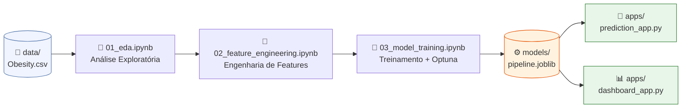

# 🏥 Predição de Obesidade — Tech Challenge 04


Projeto de machine learning para classificação do nível de obesidade com base em hábitos alimentares, atividade física e características antropométricas. Desenvolvido como Tech Challenge da Fase 4 do programa PosTech Data Analytics da FIAP.

---

## Descrição

O projeto utiliza o dataset **ObesityDataSet** (2.087 registros, 17 features) para treinar um modelo de classificação multiclasse capaz de predizer 7 categorias de peso corporal:

| Categoria           | Descrição                    |
| ------------------- | ---------------------------- |
| Insufficient Weight | Abaixo do peso               |
| Normal Weight       | Peso normal                  |
| Overweight Level I  | Sobrepeso grau I             |
| Overweight Level II | Sobrepeso grau II            |
| Obesity Type I      | Obesidade grau I             |
| Obesity Type II     | Obesidade grau II            |
| Obesity Type III    | Obesidade grau III (mórbida) |

**Objetivo:** Fornecer uma ferramenta de apoio à decisão clínica que, a partir de informações do paciente, classifica o nível de obesidade com alta acurácia e apresenta recomendações contextualizadas — tudo em Português Brasileiro.

---

## Arquitetura



O fluxo completo:

1. `data/Obesity.csv` é carregado e explorado no notebook de EDA
2. O notebook de feature engineering aplica transformações e cria novas features
3. O notebook de treinamento otimiza hiperparâmetros com Optuna e serializa o `Pipeline` completo (pré-processamento + modelo) em `models/pipeline.joblib`
4. Os dois apps Streamlit carregam o `pipeline.joblib` para inferência em tempo real

---

## Estrutura do Projeto

```text
tech-challenge-04/
│
├── apps/
│   ├── prediction_app.py       # App de predição individual de obesidade
│   └── dashboard_app.py        # Dashboard analítico com visualizações
│
├── data/
│   └── Obesity.csv             # Dataset original (não versionado no git)
│
├── models/
│   ├── pipeline.joblib         # Pipeline treinado (não versionado no git)
│   └── model_metadata.json     # Metadados: acurácia, data, hiperparâmetros
│
├── notebooks/
│   ├── 01_eda.ipynb            # Análise exploratória de dados
│   ├── 02_feature_engineering.ipynb  # Engenharia de features
│   └── 03_model_training.ipynb # Treinamento, otimização e serialização
│
├── src/
│   ├── config.py               # Constantes, mapeamentos e configurações
│   ├── logging_config.py       # Configuração de logging
│   ├── data/
│   │   ├── cleaner.py          # Limpeza e padronização dos dados
│   │   └── validator.py        # Validação de schema e tipos
│   ├── features/
│   │   └── engineer.py         # FeatureEngineer (sklearn transformer)
│   ├── models/
│   │   ├── trainer.py          # Lógica de treinamento e otimização
│   │   └── evaluator.py        # Métricas e avaliação do modelo
│   └── services/
│       ├── prediction.py       # Serviço de inferência
│       └── analytics.py        # Serviço de análises para o dashboard
│
├── tests/
│   ├── test_engineer.py        # Testes do FeatureEngineer
│   └── test_validator.py       # Testes do validador de dados
│
├── requirements.txt            # Dependências com versões fixadas
└── README.md
```

---

## Setup

### Pré-requisitos

- Python **3.11** (obrigatório — outras versões podem causar incompatibilidades de wheels)
- pip

### 1. Clonar o repositório

```bash
git clone https://github.com/<seu-usuario>/tech-challenge-04.git
cd tech-challenge-04
```

### 2. Criar e ativar ambiente virtual

```bash
python -m venv .venv

# Linux/macOS
source .venv/bin/activate

# Windows
.venv\Scripts\activate
```

### 3. Instalar dependências

```bash
pip install -r requirements.txt
```

### 4. Obter o dataset

Coloque o arquivo `Obesity.csv` na pasta `data/`. O dataset está disponível no [Kaggle — Obesity or CVD risk](https://www.kaggle.com/datasets/aravindpcoder/obesity-or-cvd-risk-classifyresponsibly).

### 5. Executar os notebooks em ordem

Os notebooks devem ser executados sequencialmente para gerar o `pipeline.joblib`:

```bash
# Abrir Jupyter
jupyter notebook

# Executar na ordem:
# 1. notebooks/01_eda.ipynb
# 2. notebooks/02_feature_engineering.ipynb
# 3. notebooks/03_model_training.ipynb
```

Após executar o notebook 03, o arquivo `models/pipeline.joblib` será gerado.

### 6. Executar os testes

```bash
pytest tests/ -v
```

### 7. Rodar os apps localmente

```bash
# App de predição
streamlit run apps/prediction_app.py

# Dashboard analítico
streamlit run apps/dashboard_app.py
```

---

## Desempenho do Modelo

| Métrica             | Valor         |
| ------------------- | ------------- |
| Tipo de modelo      | Random Forest |
| Versão              | v1            |
| Acurácia (test set) | **98,41%**    |
| F1-Score Macro      | **98,35%**    |
| Data de treinamento | 2026-05-31    |
| Amostras de treino  | 1.773         |
| Amostras de teste   | 314           |

**Hiperparâmetros otimizados via Optuna:**

| Parâmetro         | Valor |
| ----------------- | ----- |
| n_estimators      | 250   |
| max_depth         | 29    |
| min_samples_split | 8     |
| min_samples_leaf  | 3     |
| max_features      | sqrt  |

O experimento completo está rastreado via **MLflow** em `mlruns/` (não versionado no git).

---

## Stack Tecnológica

| Categoria    | Tecnologias                 |
| ------------ | --------------------------- |
| Linguagem    | Python 3.11                 |
| ML           | scikit-learn 1.5.1, XGBoost |
| Otimização   | Optuna                      |
| Rastreamento | MLflow                      |
| Visualização | Plotly, Matplotlib, Seaborn |
| Web App      | Streamlit 1.37.0            |
| Dados        | pandas 2.2.2, numpy 1.26.4  |
| Testes       | pytest                      |

---

## Apps Publicados

| App | Link |
| ----- | ------ |
| 🔮 App de Predição de Obesidade | [https://tech-challenge-04-hkhqwnvrfngfxvtyq67dnx.streamlit.app/](https://tech-challenge-04-hkhqwnvrfngfxvtyq67dnx.streamlit.app/) |
| 📊 Dashboard Analítico | [https://tech-challenge-04-y6hf8k3m2jfds8rkgvvthi.streamlit.app/](https://tech-challenge-04-y6hf8k3m2jfds8rkgvvthi.streamlit.app/) |

---

## Aviso Médico

> ⚕️ **Aviso:** Este aplicativo é uma ferramenta de apoio à decisão clínica baseada em aprendizado de máquina. Não substitui avaliação médica profissional. Os resultados devem ser interpretados por profissional de saúde habilitado.

---

## Licença

Este projeto está licenciado sob a [MIT License](LICENSE).

---

*Tech Challenge 04 — PosTech Data Analytics — FIAP*.
